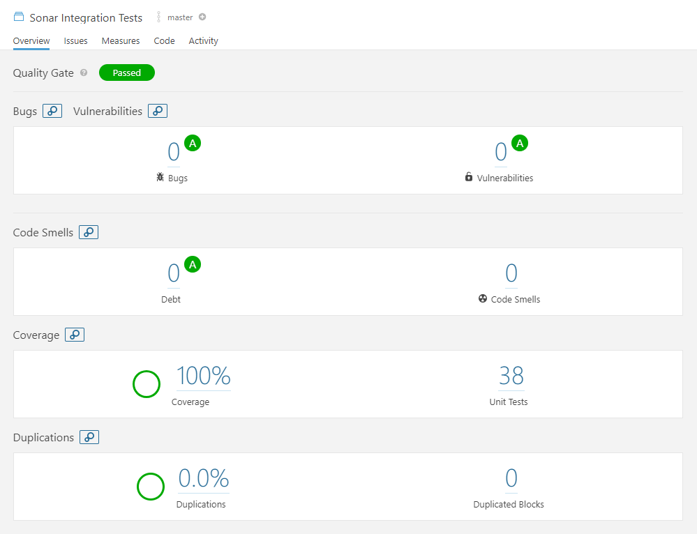

# Sonar Integration Tests

A working demo of how to use Sonar to analyze a project.\
It is a multi-module Maven project with a dedicated module to execute the integration tests and a module for code
coverage analysis.

The REST resources will be tested using unit and integration tests.\
The integration tests start a Jetty instance for testing.

## The modules
 - `coverage`: a module used to analyse the code coverage; needed because this module will add all other modules as
    dependencies, to generate the aggregated code coverage
 - `module-common`: a module which contains classes used by all modules,
 - `module-backend/rest-impl`: a module which contains the implementation for the first REST resource,
 - `module-backend/rest-war`: a module which creates the WAR file of the first REST resource,
 - `module-frontend/rest-impl`: a module which contains the implementation for the second REST resource,
 - `module-frontend/rest-war`: a module which creates the WAR file of the second REST resource,
 - `module-integration-tests`: a module which contains the integration tests for all other modules.

## Build instructions
From the root directory:
```console
foo@bar:~# mvn clean -Pintegration-tests,coverage
foo@bar:~# mvn package
foo@bar:~# mvn verify -Pintegration-tests
foo@bar:~# mvn verify -Pcoverage -DskipTests
```

Sonar analysis can be triggered using:
```console
foo@bar:~# mvn sonar:sonar -Dsonar.host.url=<sonar url>
```

Sonar status:\

