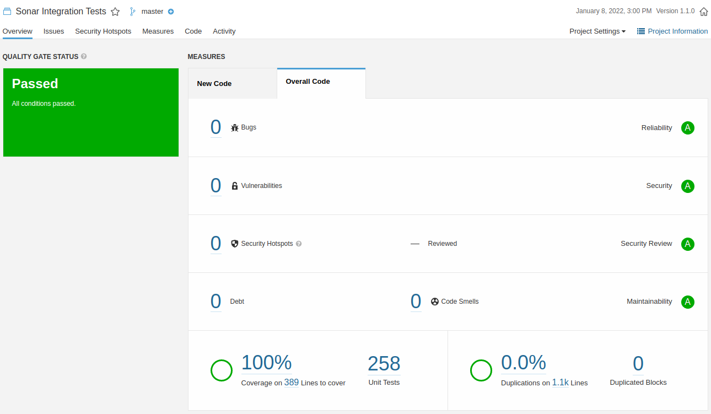

# Sonar Integration Test

A working demo of how to use Sonar to analyze a project.\
It is a multi-module Maven project with a dedicated module to execute the integration tests.

## The modules
 - `module-common`: a module which contains classes used by all modules,
 - `module-integration-test`: a module which contains the integration tests for all other modules.

## Build instructions
```console
foo@bar:~# mvn clean install
foo@bar:~# mvn -f module-integration-test/pom.xml clean install -Pit
```

Sonar analysis can be triggered using:
```console
foo@bar:~# mvn sonar:sonar -Dsonar.host.url=<sonar url>
```

Sonar status:\

